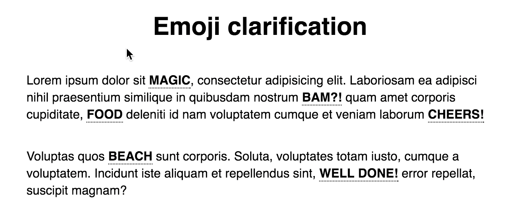

# Emoji clarification

[](https://www.npmjs.com/package/emoji-suggestions)

> Clarify your words with emojis. Check out a [live demo on CodePen](http://codepen.io/andreruffert/pen/EyBKkv).



## Install

```console
$ npm i emoji-clarification -S
```

## Usage

```css
@import "emoji-clarification";

.emoji-clarification {
  @extend %emoji-clarification;
  …
}
```

```html
<span class="emoji-clarification" data-start="✨" data-end="🦄">magic</span>
```

## License

MIT © [André Ruffert](http://andreruffert.com)
